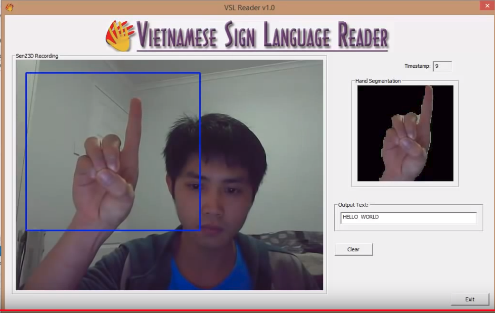

# Vietnamese sign language reader
This project describes a computer based system that utilizes a 3D sensor to bridge the communication barrier between hearing (and/or speech) impaired people and hearing ones. The proposed Vietnamese sign language reader successfully recognizes 28 static and 7 dynamic gestures taken from the Vietnam sign language dictionary. To recognize the gestures of a static type, various techniques have been deployed, such as Gabor Filtering, Fisher's Discriminant Analysis and Cosine Metric Distance method. The proposed technique achieves a good result with 93.89% accuracy and speed of 14 frames per second. Recognition of the dynamic gestures is based on the $1 Recognizer algorithm providing quite a good accuracy with 97.14% of accurate recognition with real-time running at 15 frames per second.

# Paper & Demo
Paper is available here: [IEEE Link](https://ieeexplore.ieee.org/document/7081128)

Demo in action: https://www.youtube.com/watch?v=gyM6wD-grZI

    

